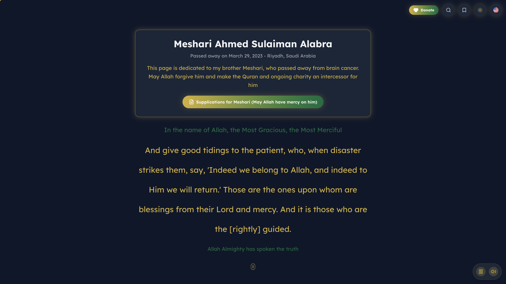
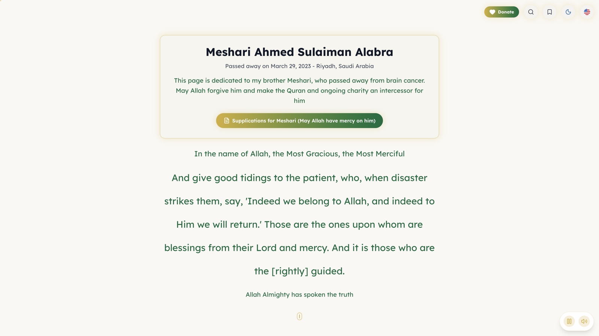
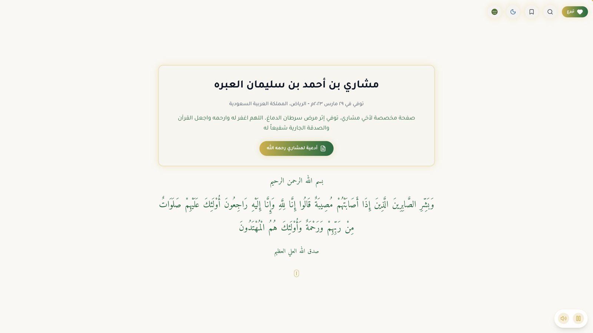
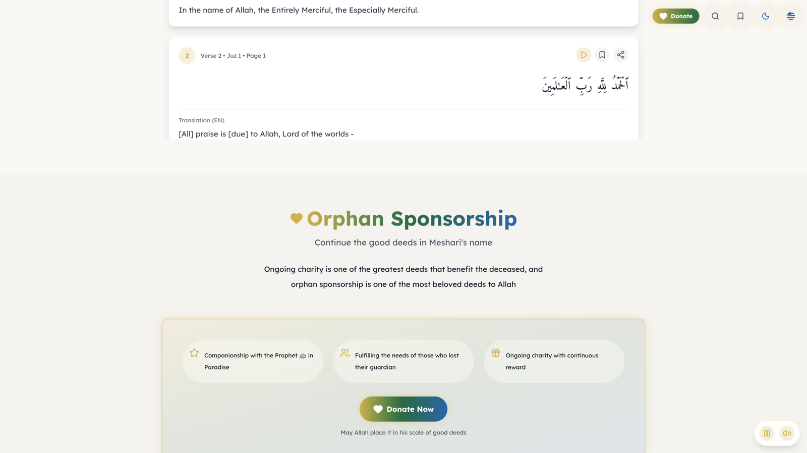
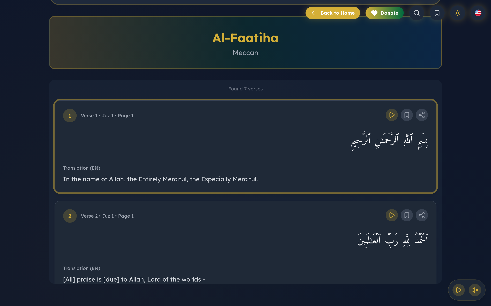
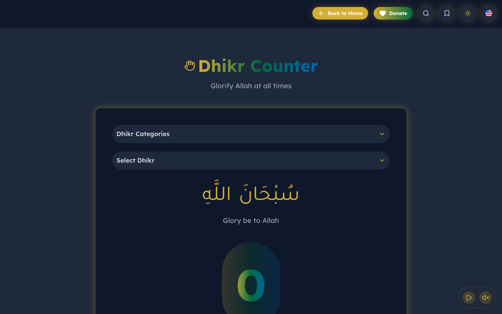

# Meshari's Continuous Charity — صدقة جارية لمشاري

<div align="center">

[](https://nextjs.org/)
[](https://www.typescriptlang.org/)
[](https://web.dev/progressive-web-apps/)
[](https://web.dev/performance/)

[](https://github.com/nawaf-inter4/meshari-alabra-ongoing-charity/actions/workflows/ci.yml)
[](https://github.com/nawaf-inter4/meshari-alabra-ongoing-charity/actions/workflows/release.yml)
[](https://github.com/nawaf-inter4/meshari-alabra-ongoing-charity/releases)
[](./LICENSE)

**A multilingual Islamic memorial site dedicated to Meshari Ahmed Sulaiman Alabra**  
**مشاري بن أحمد بن سليمان العبره**

*March 29, 2023 — may Allah have mercy on him*

[Live site](https://meshari.charity) · [Deployment guide](./DEPLOYMENT.md) · [White-label guide](./WHITE_LABELING.md) · [Donate for orphans](https://ehsan.sa/campaign/6FC11E15DA)

[](https://vercel.com/new/clone?repository-url=https://github.com/nawaf-inter4/meshari-alabra-ongoing-charity&env=NEXT_PUBLIC_SITE_URL,NEXT_PUBLIC_SITE_NAME,NEXT_PUBLIC_SITE_SHORT_NAME)
[](https://app.netlify.com/start/deploy?repository=https://github.com/nawaf-inter4/meshari-alabra-ongoing-charity)
[](https://render.com/deploy?repo=https://github.com/nawaf-inter4/meshari-alabra-ongoing-charity)

</div>

---

## Screenshots

| Dark hero (English) | Light hero (English) |
| --- | --- |
|  |  |

| Arabic RTL hero | Orphan sponsorship |
| --- | --- |
|  |  |

| Quran section | Dhikr counter |
| --- | --- |
|  |  |

---

## About

This site is a **Sadaqah Jariyah** (ongoing charity) for Meshari. It provides Quran reading, tafseer, hadith, daily supplications, prayer times, dhikr, Qibla, orphan-sponsorship links, and Quran-recitation playlists — across **12 languages** with dedicated section pages, SEO metadata, and PWA support.

Built on Next.js 16.3 Instant Navigations, Cache Components, Partial Prefetching, native YouTube players, and centralized white-label configuration.

### Core features

- YouTube Quran-recitation playlists as ongoing charity
- Orphan sponsorship via Ehsan.sa
- Islamic supplications (daily athkar and prayers for the deceased)
- Location-based prayer times with Hijri calendar
- Full Quran reading with translations (114 Surahs) — dedicated section page
- Tafseer — dedicated section page
- Hadith with authentic sources — dedicated section page
- Dhikr counter with milestone tracking — dedicated section page
- Qibla finder with compass — dedicated section page
- Quran stories (educational PDFs)
- Islamic chant and favorite-reciter sections
- 12 fully supported languages with dedicated localized pages

### Highlights

- Next.js `16.3` preview with Cache Components and Partial Prefetching
- TypeScript 7 project compilation (TypeScript 6 isolated for ESLint compatibility)
- Playwright coverage for navigation, white-label metadata, PWA, and direction-aware typography
- Native one-click YouTube playlist players with deferred third-party work
- Central config for identity, memorial content, assets, SEO, PWA, colors, and media
- Dynamic `/manifest.webmanifest` and dependency-free service worker
- Deploy templates for Vercel, Netlify, Render, Railway, and Docker
- LTR interface font: Lexend Deca · RTL interface font: Tajawal

### Sections

| Section | Path |
| --- | --- |
| Quran | `/{lang}/sections/quran` |
| Tafseer | `/{lang}/sections/tafseer` |
| Dhikr | `/{lang}/sections/dhikr` |
| Prayer times | `/{lang}/sections/prayer-times` |
| Qibla | `/{lang}/sections/qibla` |
| Donation | `/{lang}/sections/donation` |
| Supplications | `/{lang}/sections/supplications` |
| Hadith | `/{lang}/sections/hadith` |
| Quran recitations | `/{lang}/sections/youtube` |

---

## Performance

- Dynamic imports with code splitting
- Strategic API caching (Quran ~30 days, prayer times ~6 hours)
- AVIF/WebP image optimization
- DNS prefetch for external APIs
- Production console-log stripping (errors/warnings kept)
- Bundle analyzer via `npm run build:analyze`
- Self-hosted locale-aware font subsets with long-lived cache headers

**Caching strategy (approximate):**

```text
Quran API:        30 days
Prayer times:     6 hours
Fonts / static:   1 year (immutable fingerprinting where applicable)
Images:           long TTL with stale-while-revalidate where configured
```

---

## Design and UX

### Multilingual support

12 languages with complete UI translations:

| Locale | Direction | Path |
| --- | --- | --- |
| Arabic (`ar`) | RTL (primary) | `/ar` |
| English (`en`) | LTR | `/en` |
| Urdu (`ur`) | RTL | `/ur` |
| Turkish (`tr`) | LTR | `/tr` |
| Indonesian (`id`) | LTR | `/id` |
| Malay (`ms`) | LTR | `/ms` |
| Bengali (`bn`) | LTR | `/bn` |
| French (`fr`) | LTR | `/fr` |
| Chinese (`zh`) | LTR | `/zh` |
| Italian (`it`) | LTR | `/it` |
| Japanese (`ja`) | LTR | `/ja` |
| Korean (`ko`) | LTR | `/ko` |

- Landing: `/{lang}`
- Sections: `/{lang}/sections/{section}`
- `/` permanently redirects to the configured default locale (`/ar` by default)
- Legacy `/sections/{section}` permanently redirects to `/{defaultLocale}/sections/{section}`
- Multilingual SEO: language-specific metadata, keywords, canonical URLs, and hreflang

### Visual system

- Dark / light mode with Islamic color scheme
- Brand gold and deep slate / warm cream surfaces (overridable via white-label config)
- Framer Motion animations with reduced-motion respect where applied
- Fully responsive layout

### Progressive Web App

- Installable on supported mobile and desktop browsers
- Regular and maskable icons plus a generated manifest
- Previously visited same-origin pages can remain available from cache
- Localized last-resort offline screen when an uncached navigation fails
- User-controlled service-worker update prompt
- Live prayer times, location search, streaming/audio, and remote APIs require connectivity

---

## Tech stack

| Area | Choice |
| --- | --- |
| Framework | Next.js 16.3 (App Router), React 19 |
| Language | TypeScript 7 |
| Styling | Tailwind CSS, Framer Motion, Lucide icons |
| Fonts | Lexend Deca (LTR), Tajawal (RTL), Amiri / Scheherazade New (Quranic Arabic) |
| APIs | Aladhan, Al Quran Cloud, Quran.com |
| Tooling | Turbopack, Playwright, Release Please |

---

## Quick start

**Prerequisites:** Node.js 22 (20.9+ supported) and npm.

```bash
git clone https://github.com/nawaf-inter4/meshari-alabra-ongoing-charity.git
cd meshari-alabra-ongoing-charity
npm ci --legacy-peer-deps
npm run dev
```

Open [http://localhost:3000](http://localhost:3000).

```bash
npm run lint            # ESLint
npm run type-check      # TypeScript
npm run test:e2e        # Playwright suite
npm run build           # Production build
npm run build:analyze   # Bundle analyzer
```

---

## Branch and deployment flow

| Branch | Role |
| --- | --- |
| `sandbox` | Integration / **Sandbox** lane. Open feature PRs here first. This is the default branch for the Vercel Sandbox environment (non-production). |
| `main` | Production. Merge only after sandbox looks good. Powers [meshari.charity](https://meshari.charity) and GitHub Releases. |

Recommended flow:

1. Create a feature branch from `sandbox`
2. Open a PR into `sandbox` and verify the Vercel Sandbox deployment
3. When stable, open a PR from `sandbox` into `main`
4. After a feature branch is fully merged and related work is done, delete the remote (and local) feature branch
5. Release Please batches conventional commits on `main` into a release PR (`fix:` → patch, `feat:` → minor)

See [CONTRIBUTING.md](./CONTRIBUTING.md) and [DEPLOYMENT.md](./DEPLOYMENT.md).

---

## SEO and AI / LLM orientation

- Localized metadata, canonical URLs, and hreflang alternates
- Structured data for memorial / organization context where configured
- `robots.txt`, `sitemap.xml`, `feed.xml`, and `/llms.txt` (markdown agent orientation with H1 and markdown links)
- Keywords and section metadata generated from white-label config and locale files

Crawl inventory (approximate):

- Canonical localized HTML pages: **120** (12 landing + 108 section pages)
- Sitemap entries: **120**, each with reciprocal locale alternates and one `x-default`
- Root and legacy section aliases are redirects and are excluded from the sitemap

---

## Deployment

This application needs a real Next.js runtime (API routes + Cache Components). Do not deploy it as a static export. Full provider notes: [DEPLOYMENT.md](./DEPLOYMENT.md).

### One-click platforms

[](https://vercel.com/new/clone?repository-url=https://github.com/nawaf-inter4/meshari-alabra-ongoing-charity&env=NEXT_PUBLIC_SITE_URL,NEXT_PUBLIC_SITE_NAME,NEXT_PUBLIC_SITE_SHORT_NAME)
[](https://app.netlify.com/start/deploy?repository=https://github.com/nawaf-inter4/meshari-alabra-ongoing-charity)
[](https://render.com/deploy?repo=https://github.com/nawaf-inter4/meshari-alabra-ongoing-charity)

- **Vercel:** native Next.js via `vercel.json`. Production branch = `main`. Sandbox environment branch = `sandbox`.
- **Netlify:** Next.js runtime via `netlify.toml` and Netlify's official adapter.
- **Render:** Docker via `render.yaml` and `Dockerfile`.

### Railway and Docker

`railway.json` is included. For any Docker-compatible host:

```bash
cp .env.example .env.local
docker compose --env-file .env.local up --build
```

The container listens on port `3000`, runs as a non-root user, and uses Next.js standalone output.

### White-label before deploying

All core branding is centralized in [`src/config/site.ts`](./src/config/site.ts). Fork owners can edit that file or set documented `NEXT_PUBLIC_*` variables from [`.env.example`](./.env.example) to update:

- Site, organization, and short names
- Visible logo, favicon, Apple icon, PWA icons, and Open Graph image
- SEO title, description, keywords, URL, and social identity
- PWA name, identity, start URL, theme, and background colors
- Memorial headline / date / description overrides and donation URL
- Quran and favorite-reciter playlist / thumbnail IDs
- Brand, accent, link, light-mode, and dark-mode colors

See [WHITE_LABELING.md](./WHITE_LABELING.md). Never put passwords, tokens, private keys, or secrets in `NEXT_PUBLIC_*` variables.

### Copy-ready AI agent prompt

Copy this prompt into Hermes, Claude Code, Codex, OpenCode, or another coding agent after cloning or forking the repository. Replace the bracketed values first.

```text
Configure and validate my fork of nawaf-inter4/meshari-alabra-ongoing-charity.

Branding and deployment inputs:
- Site name: [SITE NAME]
- Short/PWA name: [SHORT NAME]
- Organization: [ORGANIZATION]
- Canonical production URL: [HTTPS URL]
- Default locale: [LOCALE]
- Default direction: [ltr OR rtl]
- Memorial legal name: [NAME]
- Memorial display name: [NAME]
- Memorial alternate-script name: [NAME]
- Memorial date: [YYYY-MM-DD]
- Respectful hero description: [DESCRIPTION]
- Donation URL: [HTTPS URL]
- Logo path: [PUBLIC PATH]
- Favicon path: [PUBLIC PATH]
- Apple/PWA icon paths: [PUBLIC PATHS]
- Open Graph image path: [PUBLIC PATH]
- Brand, accent, link, light, and dark colors: [COLORS]
- Quran playlist and representative thumbnail video IDs: [IDS]
- Favorite-reciter playlist and representative thumbnail video IDs: [IDS]
- Deployment target: [Vercel, Netlify, Render, Railway, or Docker]

Requirements:
1. Read README.md, WHITE_LABELING.md, `/llms.txt`, .env.example,
   src/config/site.ts, and the selected provider manifest before editing.
2. Use src/config/site.ts and documented NEXT_PUBLIC_* values as the central
   white-label source. Do not scatter identity, domains, assets, or colors
   through components. Use translationOverrides for localized copy.
3. Preserve Quranic text exactly and keep all memorial/religious language
   respectful. Do not replace content that I did not explicitly provide.
4. Keep the application on its current Next.js 16.3 preview, Cache Components,
   Partial Prefetching, Instant Navigations, React 19, and TypeScript 7 setup.
5. Preserve native one-click YouTube players. A playlist ID controls playback;
   its representative video ID supplies the native poster, and the iframe is
   inserted near the viewport to defer third-party work.
6. Preserve direction-aware typography: LTR interface controls use Lexend Deca;
   RTL interface controls use Tajawal; Quranic Arabic may use its dedicated
   Arabic/Quran font. Never add a broad CSS selector that overrides both.
   Keep landing-page titles for dedicated sections clickable, and generate every
   section URL with the active locale (`/[lang]/sections/[section]`).
7. Never commit .env, .env.local, credentials, tokens, private keys, .agents/,
   .claude/, skills-lock.json, SKILL.md, Playwright output, or browser state.
   Only .env.example may be committed, and it must contain placeholders.
8. NEXT_PUBLIC_* values are public browser data. Never place a secret in one.
9. Do not configure static-only hosting: the app requires a Next.js runtime for
   API routes and dynamic behavior.
10. Branch from `sandbox`, open PRs into `sandbox` first, then promote to `main`.
    Delete feature branches after they are fully merged.
11. After implementation, run and report real output from:
    npm ci --legacy-peer-deps
    npm run lint
    npm run type-check
    npm run test:e2e
    npm run build
    git diff --check
12. In browser tests, verify the configured title, canonical URL, logo, favicon,
    /manifest.webmanifest, theme variables, both YouTube thumbnails, donation
    destination, an LTR route, an RTL route, and computed CTA font families.
13. Validate the selected provider manifest and, for Docker, build the image and
    smoke-test /, /manifest.webmanifest, and /api/ip-location without inventing
    successful output if a provider or Docker is unavailable.
14. Show me the final diff and validation results before committing or deploying.
```

### Post-deployment checklist

- [ ] Configure custom domain
- [ ] Verify HTTPS is enabled
- [ ] Test PWA installation and service worker
- [ ] Verify prayer times API
- [ ] Smoke-test LTR and RTL locales
- [ ] Confirm `/health`, `/manifest.webmanifest`, `/llms.txt`, and sitemap
- [ ] Run Lighthouse / PageSpeed on mobile

---

## Features breakdown

### YouTube playlist

- Embedded Quran recitation playlists
- Responsive 16:9 native players
- Deferred third-party iframe work near the viewport
- Direct playlist links

### Orphan sponsorship

- Direct integration with the Ehsan.sa campaign
- Benefits of orphan sponsorship listed
- Header and section CTAs labeled for orphan sponsorship (not a generic “Donate”)

### Prayer times and Hijri calendar

- Geolocation with fallback to Riyadh, Saudi Arabia
- Five daily prayers plus sunrise
- Hijri and Gregorian dates
- Location display

### Quran

- All 114 Surahs
- Arabic text rendering with translations
- Search and surah selection
- Long-lived API caching

### Tafseer

- Search by Surah and Ayah
- Multiple interpretation sources
- Readable HTML rendering

### Hadith

- Authentic selections with Arabic and translation
- Source references (e.g. Bukhari, Muslim)

### Dhikr counter

- Digital tasbih options (SubhanAllah, Alhamdulillah, Allahu Akbar)
- Milestone tracking and reset
- Haptic feedback on supporting devices

### Qibla finder

- Compass direction and distance to Makkah
- Device orientation / geolocation support

---

## Security and privacy

**Security headers (via Proxy / platform):** HSTS, frame protections, nosniff, XSS filter, referrer and permissions policies as configured in `src/proxy.ts` and provider settings.

**Privacy:**

- Vercel Analytics and Speed Insights are configurable; analytics can be disabled with the documented public setting
- Prayer times and Qibla may use visitor IP/browser location with permission or API lookup
- Browser storage is used for preferences, bookmarks, PWA dismissal state, and cached offline resources
- External Quran, prayer, geolocation, donation, audio, and YouTube services have their own privacy policies

---

## Orphan sponsorship

Continue Meshari's legacy through orphan sponsorship (كفالة اليتيم):

[Donate for orphans via Ehsan.sa](https://ehsan.sa/campaign/6FC11E15DA)

> When a person dies, his deeds come to an end except for three: ongoing charity, beneficial knowledge, or a righteous child who prays for him.  
> — Prophet Muhammad ﷺ (Sahih Muslim 1631)

---

## Development notes

### Code structure

```text
meshari-alabra-ongoing-charity/
├── src/
│   ├── app/                         # Next.js App Router
│   │   ├── [lang]/                  # Localized landing + sections
│   │   ├── api/                     # Quran proxy, location, audio, etc.
│   │   ├── llms.txt/route.ts        # Agent orientation file
│   │   ├── sitemap.ts / robots.ts / manifest.ts / og-image/
│   │   └── globals.css
│   ├── components/                  # UI, sections, wrappers, PWA, audio
│   ├── config/site.ts               # White-label identity and media
│   ├── lib/                         # Metadata, translations, routes
│   ├── locales/                     # 12 language JSON packs
│   └── proxy.ts                     # Routing + security headers
├── public/                          # Icons, fonts, stories, sw.js, offline.html
├── tests/e2e/                       # Playwright suite
├── docs/screenshots/                # README screenshots
├── vercel.json / netlify.toml / render.yaml / railway.json / Dockerfile
└── package.json
```

### Key technologies

- Dynamic imports and deferred client shells for non-critical UI
- Dependency-free service worker with bounded caching
- Image optimization (AVIF/WebP)
- Direction-aware self-hosted fonts
- Strategic caching for external APIs

---

## In memory of

**Meshari Ahmed Sulaiman Alabra**  
**مشاري بن أحمد بن سليمان العبره**

*Passed away on March 29, 2023 in Riyadh, Saudi Arabia*

> إِنَّا لِلَّهِ وَإِنَّا إِلَيْهِ رَاجِعُونَ  
> *Indeed we belong to Allah, and indeed to Him we will return.*

May Allah have mercy on him, forgive his sins, expand his grave, and accept every Quran recitation, prayer, and charitable act done through this platform in his favor.

---

## Contributing

This is a memorial project. Please read [CONTRIBUTING.md](./CONTRIBUTING.md).

1. Branch from `sandbox`
2. Keep changes focused and respectful
3. Run `npm run lint`, `npm run type-check`, `npm run test:e2e`, and `npm run build`
4. Use [Conventional Commits](https://www.conventionalcommits.org/) so Release Please can batch patch/minor releases
5. Open a PR into `sandbox`, then promote to `main`
6. Delete the feature branch after it is fully merged

---

## License

Source code is available under the [MIT License](./LICENSE). Dedicated to the memory of Meshari Ahmed Sulaiman Alabra as ongoing charity.

---

## Links

- Live site: [https://meshari.charity](https://meshari.charity)
- Releases: [GitHub Releases](https://github.com/nawaf-inter4/meshari-alabra-ongoing-charity/releases)
- Issues: [GitHub Issues](https://github.com/nawaf-inter4/meshari-alabra-ongoing-charity/issues)
- Orphan sponsorship: [Ehsan.sa campaign](https://ehsan.sa/campaign/6FC11E15DA)

<div align="center">

**اللَّهُمَّ اغْفِرْ لَهُ وَارْحَمْهُ**

*May Allah forgive him and have mercy upon him*

Sadaqah Jariyah — صدقة جارية

</div>
